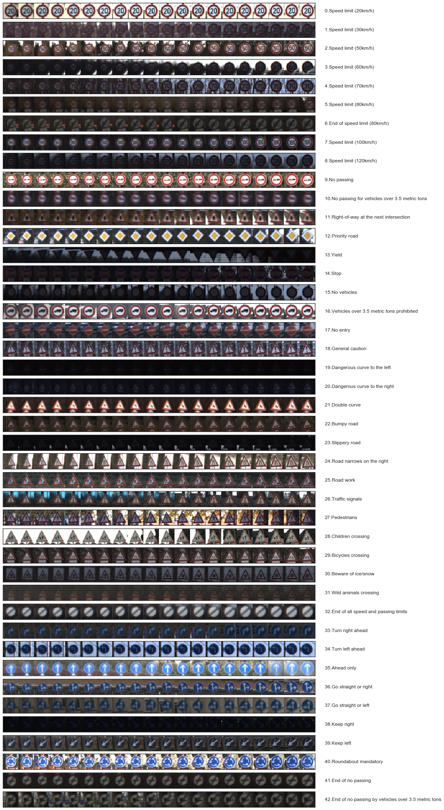
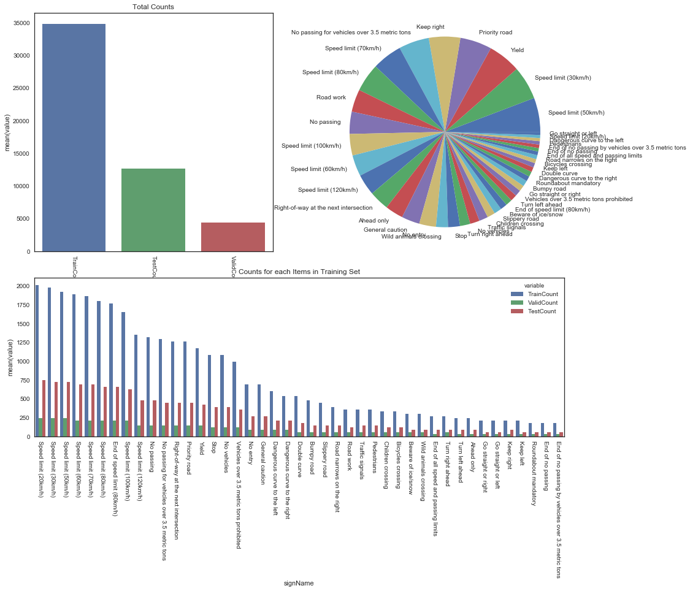
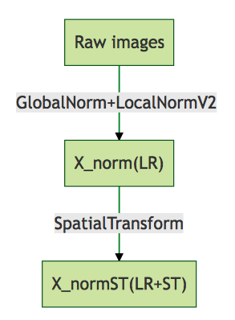
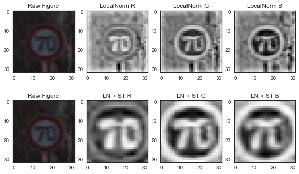
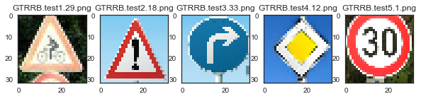
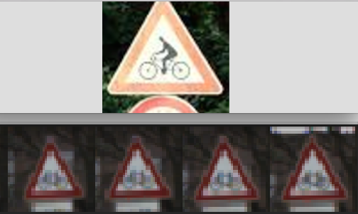
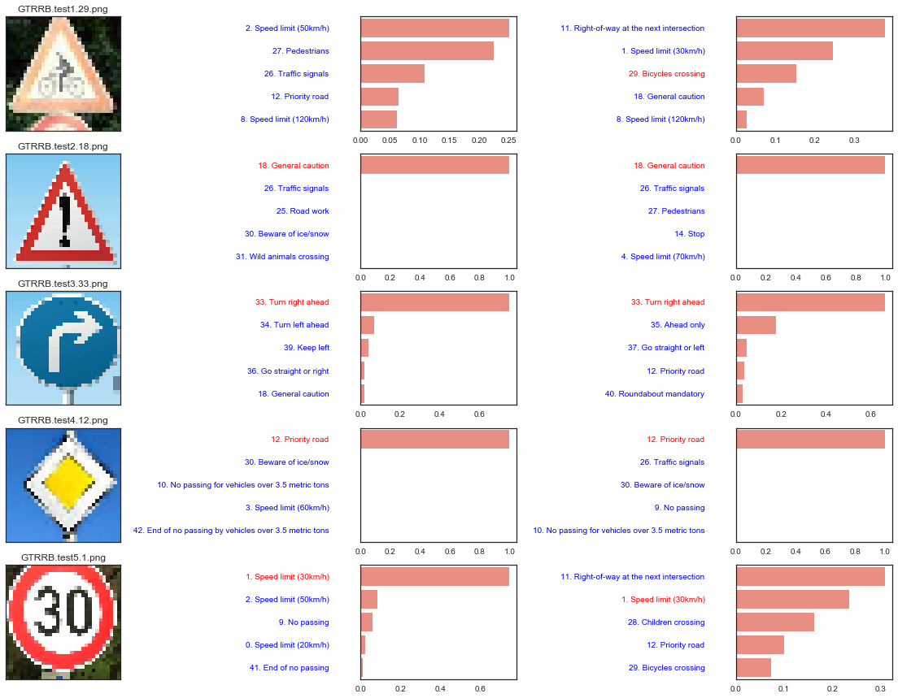
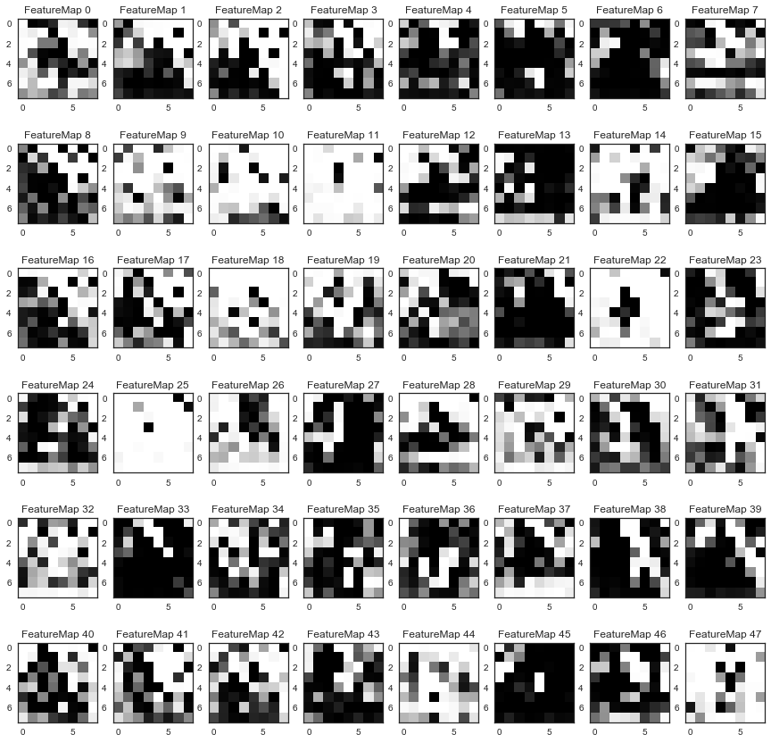

#**Traffic Sign Recognition** 

<link rel="stylesheet" href="./mermaid/dist/mermaid.forest.css"/>

<script src="./mermaid/dist/mermaid.js"></script>
<script>
    var config = {
        startOnLoad:true,
        callback:function(id){
            console.log(id,' rendered');
        },
        flowchart:{
            useMaxWidth:false,
            htmlLabels:true
        },
        logLevel:5
    };
    mermaid.initialize(config);
</script>

<script>
	function coolAction(){
		console.log('Got callback in user defined function');
	}
</script>

<style>
        .cluster {
            fill: #fcac93;
            rx:4px;
            stroke: grey;
        }
</style>


##Writeup Template

###You can use this file as a template for your writeup if you want to submit it as a markdown file, but feel free to use some other method and submit a pdf if you prefer.

---

**Build a Traffic Sign Recognition Project**

The goals / steps of this project are the following:
* Load the data set (see below for links to the project data set)
* Explore, summarize and visualize the data set
* Design, train and test a model architecture
* Use the model to make predictions on new images
* Analyze the softmax probabilities of the new images
* Summarize the results with a written report

## Rubric Points
###Here I will consider the [rubric points](https://review.udacity.com/#!/rubrics/481/view) individually and describe how I addressed each point in my implementation.  

---
###Writeup / README

####1. Provide a Writeup / README that includes all the rubric points and how you addressed each one. You can submit your writeup as markdown or pdf. You can use this template as a guide for writing the report. The submission includes the project code.

You're reading it! and here is a link to my [project code](https://github.com/huboqiang/CarND-TrafficSigns-P2/Traffic_Sign_Classifier.html)

###Data Set Summary & Exploration

####1. Provide a basic summary of the data set and identify where in your code the summary was done. In the code, the analysis should be done using python, numpy and/or pandas methods rather than hardcoding results manually.

The code for this step is contained in the second code cell of the IPython notebook.  

I used the pandas library to calculate summary statistics of the traffic
signs data set:

```python
# TODO: Number of training examples
n_train = X_train.shape[0]

# TODO: Number of testing examples.
n_test = X_test.shape[0]

# TODO: What's the shape of an traffic sign image?
image_shape = [X_train.shape[1], X_train.shape[2]]

# TODO: How many unique classes/labels there are in the dataset.
n_classes = len(set(y_train))

print("Number of training examples =", n_train)
print("Number of testing examples =", n_test)
print("Image data shape = %d x %d" % (image_shape[0], image_shape[1]))
print("Number of classes =", n_classes)
```

Results:

* The size of training set is 34799
* The size of test set is 12630
* The shape of a traffic sign image is 32 x 32
* The number of unique classes/labels in the data set is 43

####2. Include an exploratory visualization of the dataset and identify where the code is in your code file.

The code for this step is contained in the fourth and sixth code cell of the IPython notebook.  

Here is an exploratory visualization of the data set. Firstly, I just select 20 images for all 43 labels randomly and plot these images using matplotlib.



Then the total counts for training set, validation set and testing sets were plotted using barplot(top left). The fraction of each item for these 43 labels were also plotted using a pie-plot(top right). Finally, the number for each label of training set, validation set and testing set were also plotted using barplot(bottom).



###Design and Test a Model Architecture

####1. Describe how, and identify where in your code, you preprocessed the image data. What tecniques were chosen and why did you choose these techniques? Consider including images showing the output of each preprocessing technique. Pre-processing refers to techniques such as converting to grayscale, normalization, etc.

My preprocessing includes:

- Global normalization for mean value and stand derivation.
- Local normalization __(LN)__
- Spatial normalization __(ST)__
 
which was proposed by the [published baseline model](http://yann.lecun.com/exdb/publis/pdf/sermanet-ijcnn-11.pdf).

Code of Global Normalziation were put in the 7th code cell of the Jupyter notebook, in function ```GlobalNorm```.

Code of Local Normalization were re-written from a theano version [https://github.com/jostosh/theano_utils/blob/master/lcn.py](https://github.com/jostosh/theano_utils/blob/master/lcn.py), in the 7th code cell of the notebook, function ```LocalNormV2```.

Code of Spatial Normalization were just copied from github of tensorflow [https://github.com/tensorflow/models/blob/master/transformer/spatial_transformer.py](https://github.com/tensorflow/models/blob/master/transformer/spatial_transformer.py), in the 10th and 11st code cell of the notebook, function ```SpatialTransform ```.

The whole pipeline looks like:



<div style="width:200px">
<div class="mermaid" id="i141">

        graph TD
       A["Raw images"] -- "GlobalNorm+LocalNormV2" --> B["X_norm(LN)"]
       B -- "SpatialTransform" --> C["X_normST(LN+ST)"]

</div>
</div>

The ```X_norm``` pictures were shown in the top 3 pictures for RBG channel respectly and X_normST were shown in the bottom.




The difference between the original data set and the normalizede data set is the that after LN, the picture is more clear and ST helped select the region of interests(ROI).


####2. Describe how, and identify where in your code, you set up training, validation and testing data. How much data was in each set? Explain what techniques were used to split the data into these sets. (OPTIONAL: As described in the "Stand Out Suggestions" part of the rubric, if you generated additional data for training, describe why you decided to generate additional data, how you generated the data, identify where in your code, and provide example images of the additional data)

The code for splitting the data into training and validation sets is contained in the 6th code cell of the IPython notebook.  

As the training set and validation set were well splitted, I did not split that. If I need to do that, I would using a scikit-learn module [```train_test_split```](http://scikit-learn.org/stable/modules/generated/sklearn.model_selection.train_test_split.html) to do that.


No argumented dataset were generated because the result is well enough to pass 93% criteria.  Futhermore, it seemded that the performance were not better if I used ```ImageDataGenerator``` from Keras using parameters: ```rotation_range=20,width_shift_range=0.2,height_shift_range=0.2``` (results unshown).


####3. Describe, and identify where in your code, what your final model architecture looks like including model type, layers, layer sizes, connectivity, etc.) Consider including a diagram and/or table describing the final model.

The code for my final model is located in the 14th and 16th cell of the ipython notebook. 

My final model consisted of the following layers:

 Layer         	     |     Description 
:---------------------:|:---------------------------------------------:
Input            	    	| 32x32x3 RGB image                             
Convolution 5x5       	| 1x1 stride, same padding, outputs 32x32x108    
RELU					        |	
Max pooling	      	   | 2x2 stride,  outputs 16x16x108
Convolution 5x5       	| 1x1 stride, same padding, outputs 16x16x200
RELU					        |	
Max pooling	      	   | 2x2 stride,  outputs 8x8x200
Flatten    	      	   |  8x8x200 => 12800
Fully Connection        | 12800 => 100
tanh                    |
Fully Connection        | 100 => 43
 


####4. Describe how, and identify where in your code, you trained your model. The discussion can include the type of optimizer, the batch size, number of epochs and any hyperparameters such as learning rate.

The code for training the model is located in the 16th and 18th cell of the ipython notebook. This model used Adam as optimizer to minimize the cross entropy between predicting probability and true 0/1 classified labels with learning rate of 0.001, a batch-size of 128 with 10 epoches.


####5. Describe the approach taken for finding a solution. Include in the discussion the results on the training, validation and test sets and where in the code these were calculated. Your approach may have been an iterative process, in which case, outline the steps you took to get to the final solution and why you chose those steps. Perhaps your solution involved an already well known implementation or architecture. In this case, discuss why you think the architecture is suitable for the current problem.

The code for calculating the accuracy of the model is located in the ninth cell of the Ipython notebook.

My final model results were:

Item | LN	| LN+ST
---|---|---
training set accuracy | 1.0 | 1.0
validation set accuracy | 0.948 | 0.961
test set accuracy | 0.946 | 0.949

At the very beginning, I chosed lenet-5 only to increase the number of channels of input, from 1 to 3, and the output layer from 10 to 43. The accuracy for validation is around 0.87, just like what was mentioned in the notebook of this project. 

So I read the lecun's paper carefully, and made some revision just like him. The alternatives were mainly on the preprocessing, I perfromed three layers of normalization for the inputs. Some changes were also made on the architecture of this model, including more kernels on the convolutionary kernel, as well as using tanh to replacing relu rectifiy instead. More kernels were used because the dataset is much more than MNIST which requires more parameters and tanh could be more suitable for normalized input data. 

This model seemed to be overfit because the accuracy of training set is higher than the validation set. I tried to add a dropout layer after the convolutionary layer, which could reduce the gap between training error and validation error. However, the accuracy for validation and test set would also reduce to around 90%. So I think this overfit is good because it can really promote the accuracy of this model. 

Lastly, in lecun's artical, a cnorm layer were used after convolutionary layer, just like the local normalization process, which could increase the accuracy of the model to 99%. However, I tried this but failed. Maybe there are some bugs for my local normalization code.

 

###Test a Model on New Images

####1. Choose five German traffic signs found on the web and provide them in the report. For each image, discuss what quality or qualities might be difficult to classify.

Here are five German traffic signs that I found on the web (converted to 32x32 using cv2):



The first image might be the most difficult one to classify because firstly, this given picture has a man on a bicycle while there are no man on the bike for the training set. Secondly, in the training set,  it is usually a white-blank-rect sign under this tri-angle traffic sign while there are no such rect sign in this new image. Lastly in the training set image, the number of pixal for bicycle is very limited so the image is not clear. 



Other pictures seemed to be much easier to identify. The only difference is that the testing picture I downloaded from the internet is brighter in the background.

####2. Discuss the model's predictions on these new traffic signs and compare the results to predicting on the test set. Identify where in your code predictions were made. At a minimum, discuss what the predictions were, the accuracy on these new predictions, and compare the accuracy to the accuracy on the test set (OPTIONAL: Discuss the results in more detail as described in the "Stand Out Suggestions" part of the rubric).

The code for making predictions on my final model is located in the 28th cell of the Ipython notebook.

Here are the results of the prediction:

Image			         | LN Prediction  | LN+ST Prediction
:------------------:|:--------------:|:--------------:
Bicycles crossing      		| Speed limit(30km/h) | Right-of-way at the next intersection
Gerneral Caution   			| Gerneral Caution    | Gerneral Caution
Ture right ahead			   | Ture right ahead    | Ture right ahead
Priority Road             | Priority Road       | Priority Road 
Speed limit(30km/h)       | Speed limit(30km/h)       | Right-of-way at the next intersection
Top1 accuracy             | 4/5 (80%)            | 3/5(60%) 
Top5 accuracy             | 4/5 (80%)            | 5/5(100%) 


The LN model was able to correctly guess 4 of the 5 traffic signs, which gives an accuracy of 80% while the LN+ST Norm model guess 3 of the 5 traffic signs with accuracy of 60%. This compares favorably to the accuracy on the test set.

####3. Describe how certain the model is when predicting on each of the five new images by looking at the softmax probabilities for each prediction and identify where in your code softmax probabilities were outputted. Provide the top 5 softmax probabilities for each image along with the sign type of each probability. (OPTIONAL: as described in the "Stand Out Suggestions" part of the rubric, visualizations can also be provided such as bar charts)

The code for making predictions on my final model is located in the 32nd cell of the Ipython notebook.



Col1 is the input figure, col2 for Local Normalization and col3 for LN+ST normalization.

For the first testing image, as I mentioned above, there are no person on the bicycle in the training picure and the bottom is a rect rather than one part of a circle, so the input image would really puzzled this model. So LN model did not report it as a high probabiliby. However, as LN+ST would generate a ROI, the bottom area would be ignored so that LN+ST model could report it as top3 candidates.

Image 2-5 were all very clear so that LN performed well. But LN+ST put the correct answer to the 2nd place in the 5th input image.

So maybe the LN made the model fit the training set better but of low generalization level. LN+ST could improve the generalization level of the model but not that accurate.

####4. The output for the convolutionary kernel

The code were put in the 34th cell of the notebook. The first images of the 5 inputs for testing were used and only the output first 48 kernels out of 200 were shown here.

